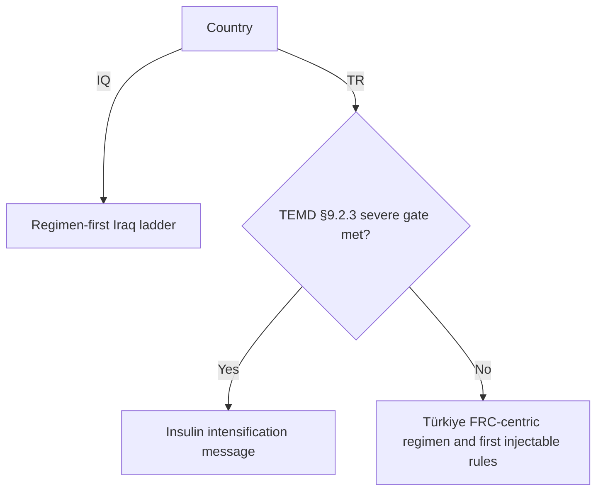

# T2D Injectable Therapy CDS (Pyodide / GitHub Pages)

Country-adaptive clinical decision support (**prototype**) for adults with **type 2 diabetes** — **injectable layer only**:

- First injectable (where applicable)
- Intensification and simplification on current injectable regimens

Runs fully **client-side** (Pyodide). No backend, no persistent patient storage.

> **Current deployment is Iraq (IQ) only.** The Türkiye (TR) branch is **disabled legacy**: the engine flag `TR_ENABLED = False` (in `py/engine.py`) short-circuits TR, and the TR-specific UI markup (country selector, numeric HbA1c/BMI, FPG/random PG, TEMD panel, TR regimen set, algorithm TR/Shared tabs) is commented out. Re-enable by setting `TR_ENABLED = True` and uncommenting the TR markup.

Clinical traceability for **Türkiye (TR)** is aligned to **[TEMD Diabetes Mellitus ve Komplikasyonlarının Tanı, Tedavi ve İzlem Kılavuzu 2024](docs/TEMD_diabetesmellitus2024.pdf)** for the implemented nodes (**§9.2.3**, **Bölüm 8** insulin recommendations, **Şekil 9.4 / §9.2.4** comorbidity emphasis as coded). **Şekil 9.2–9.3** oral-agent escalations are **not** modelled — see scope below.

---

## Disclaimer

Does **not** replace clinical judgement, local policy, prescribing information, or TEMD in full.

**Iraq (IQ)** pathway deliberately **excludes** a severe hyperglycaemia shortcut; unstable severe presentations need urgent clinician-led management.

**Türkiye (TR)** applies a **documented insulin-start / escalation gate** aligned to TEMD — this is **not** the same as “all care for unstable hyperglycaemia is in scope”: ketotic states, inpatient care, and full metabolic work-up remain outside this viewer.

---

## Scope limits (important)

- **Injectable therapy only.** Oral metformin, SGLT2 inhibitors, DPP-4 inhibitors, SU/GLN, pioglitazone, triple oral therapy (**TEMD Şekil 9.2–9.3**) are **not** stepped through — the tool assumes you are deciding **injectables** (and documents where metformin continuation is guideline-consistent).
- **Active country:** **IQ** (Iraq). **TR** (Türkiye) remains in `py/engine.py` as **disabled legacy** behind `TR_ENABLED`. References to **Jordan** or additional countries elsewhere are **not** implemented unless added to code.

---

## Inputs (synced with `index.html`)

The active UI is **Iraq-only** and consists of **four binary radio groups** (one "Patient profile" block) plus the current-regimen radios:

| Radio group | `name` | Options |
|-------------|--------|---------|
| **HbA1c vs individualised target** | `hba1c_band` | `lt2` (<2% above target, default) / `ge2` (≥2% above target) |
| **BMI band** | `bmi_band` | `le30` (≤30, default) / `gt30` (>30) |
| **Irregular meal patterns** | `irregular_meal_patterns` | `no` (default) / `yes` (suppresses premix wherever the algorithm would offer it) |
| **GLP-1 RA accessible / tolerated** (monotherapy) | `iq_glp1_ra_access` | `no` (default) / `yes` |
| **Current injectable regimen** | `regimen_iq` | none · basal-only · GLP-1 alone · BI+GLP-1 · BI+GLP-1+rapid · premix · BB |

Every Iraq recommendation also returns a standardised **Key Considerations** block, rendered with per-line icons.

> **Legacy (TR) inputs — disabled.** The country selector, **numeric** HbA1c / target / BMI, FPG / random PG (+ units), the TEMD severe-gate symptom and Şekil 9.4 comorbidity checkboxes, and the TR regimen set are commented out in `index.html` (kept for easy re-enable). They were TR-only and are unused while `TR_ENABLED = False`.

**Glucose conversion (TR legacy):** mmol/L × **18.018** → mg/dL.

**Result card:** the recommendation panel follows the consensus slide design — a green primary recommendation banner, icon-led Rationale / Next steps sections, and a standardised **Key Considerations** block with per-line icons.

---

## Türkiye (TR) logic summary (`py/engine.py`) — *disabled legacy (`TR_ENABLED=False`)*

### Severe insulin gate (before regimen branches)

Triggers if **any** of:

1. Hyperglycaemic symptoms, weight loss/catabolic signs, or suspected DKA/HHS-type emergency (**§9.2.3** pattern),  
2. **HbA1c ≥ 9%**,  
3. **Fasting / APG \> 250 mg/dL** (FPG input),  
4. **Random PG \> 300 mg/dL** (random PG input),

Output references **§9.2.3** (basal–bolus vs premix, continue metformin when safe, SMBG/CGM, consider type 1 / LADA).

**Note:** Patients with presentation **HbA1c ≥ 9%** will **always** meet this gate before first-injectable FRC branching — intentional given TEMD insulin-start wording for that band.

### Regimen ladders

FRC-first intensification, simplification BB/premix → FRC when recurrent hypo, basal → FRC when unmet / PPG uncontrolled — unchanged in structure.

### First injectable

- \(\Delta\) = current HbA1c − target (default target **7.0%** if current HbA1c supplied without target).

- **Δ ≥ 2%** and **HbA1c \< 9%** → **Start FRC** (with SGK BMI \<35 commentary when BMI known).

- **Δ \< 2%**, **BMI \> 30** → **Start FRC**.

- **Δ \< 2%**, **BMI ≤ 30** → **Start basal insulin** unless any comorbidity flag → **Start FRC** (**Şekil 9.4** proxy).

Basal insulin recommendations append **modern basal analogue** wording (aligned to TEMD insulin chapter themes).

### SGK / reimbursement

**FRC BMI \< 35 kg/m² commentary** reflects **Turkish reimbursement / access practice** as operational note — **not** a numbered TEMD clinical threshold in the sections cited in-code.

---

## Iraq (IQ) logic summary

Regimen-first algorithm aligned to the **Cases Consensus (Iraq)** document. Routing is driven by the **current injectable regimen**, then HbA1c distance above the individualised target (`<2%` vs `≥2%`), BMI (`≤30` vs `>30`), meal pattern, and `iq_glp1_ra_access` (binary Yes/No, default No). **No** TR severe glucose gate.

Regimen ladder (each returns a standardised **Key Considerations** block):

- **None / first injectable** — `<2%` & BMI ≤30: start basal insulin; `<2%` & BMI >30: GLP-1 RA monotherapy (access Yes) or FRC (access No); `≥2%`: start BI + GLP-1 RA combination (premix only as an alternative when FRC unavailable and meals regular).
- **On basal insulin (unmet)** — `<2%`: titrate basal to fasting (≈0.5 U/kg/day) **and add GLP-1 RA**; `≥2%`: move to BI + GLP-1 RA combination.
- **On GLP-1 RA (unmet)** — `<2%`: optimise GLP-1 RA **and add basal**; `≥2%`: BI + GLP-1 RA combination.
- **On BI + GLP-1 RA (unmet)** — optimise, then add stepwise prandial (largest meal first) → **BI (max) + GLP-1 RA + rapid**; premix alternative only with regular meals.
- **On BI + GLP-1 RA + rapid (unmet)** — intensify to **basal-bolus** (optimise BI + GLP-1 RA + prandial first); premix alternative only with regular meals.
- **On premix** — prefer **transition to FRC** (simplification) where accessible; alternative intensify to basal-bolus.
- **On basal-bolus** — prefer **transition to FRC** (simplification); alternative switch to premix (suppressed under irregular meals, i.e. FRC-only).

Irregular meal patterns suppress premix wherever it would otherwise appear. `recurrent_hypoglycemia` (premix / basal-bolus) reinforces the simplification rationale.

See [algorithm.html](algorithm.html) for narrative and Mermaid.

---

## Viewing diagrams

Interactive / printable trees: **[algorithm.html](algorithm.html)** (Iraq tab active; Türkiye and Shared-gates tabs are commented out as legacy).

---

## High-level routing (conceptual — see code for authority)

